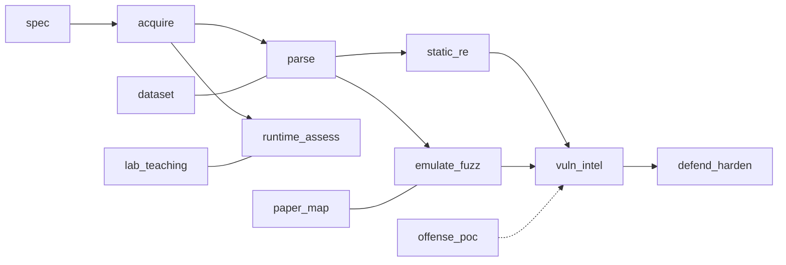

# uefi-firmware-atlas

**Living map of PC/server UEFI/BIOS platform firmware research** — tools, papers, datasets, vulns — organized by a **research closed-loop**, not a flat awesome dump.

Sibling of [`oss-atlas`](https://github.com/vulragrag-star/oss-atlas). Part of the planned **firmware-atlas** series (`linux-kernel` / `iot` / `rtos` / `mcu` atlases come next, as separate repos).

## Why another list?
Existing seeds are valuable but incomplete or differently scoped:
- [river-li/awesome-uefi-security](https://github.com/river-li/awesome-uefi-security)
- [PreOS-Security/awesome-firmware-security](https://github.com/PreOS-Security/awesome-firmware-security) (explicitly excludes IoT OS lists)
- [killvxk/awesome_uefi_code](https://github.com/killvxk/awesome_uefi_code)
- [dwendt/awesome-uefi](https://github.com/dwendt/awesome-uefi)

This repo adds: **closed-loop taxonomy**, **machine-readable JSONL**, **use-tags** (paper-repro / daily-ops / lab-usable / hw-required), **setting book**, and **smoke notes** for cloud VMs.

## Closed-loop map



See [`docs/MAP.md`](docs/MAP.md), [`docs/TAXONOMY.md`](docs/TAXONOMY.md), [`docs/SETTING.md`](docs/SETTING.md), [`docs/SMOKE.md`](docs/SMOKE.md).

## Layout
| Path | Role |
|---|---|
| `data/tools.jsonl` | Tool catalog (schema in `data/schema.json`) |
| `data/papers.jsonl` / `vulns.jsonl` / `datasets.jsonl` | Research intel |
| `catalogs/` | Human-readable views by stage |
| `scripts/` | validate / render / enrich |
| `docs/` | Taxonomy, method, setting book, smoke plan |

## Quick start
```bash
python scripts/validate_catalog.py
python scripts/render_catalogs.py
```

## Status (initial seed — 2026-09-10)
- Tools JSONL seeded from curated core + upstream awesome lists (enrichment ongoing via multi-agent crawl)
- Papers / vulns / datasets: starter rows (BlackLotus, LoJax, MoonBounce, CosmicStrand, Bootkitty, LogoFAIL, FUZZUER, CHIPSEC, FwHunt, DVUEFI, LVFS)
- Smoke: documented green/yellow/red paths for Linux cloud VMs (no SPI/DMA fantasy)

### Tool counts by stage

| Stage | n |
|---|---|
| acquire | 4 |
| defend_harden | 5 |
| emulate_fuzz | 4 |
| lab_teaching | 2 |
| offense_poc | 4 |
| parse | 3 |
| runtime_assess | 4 |
| spec | 5 |
| static_re | 8 |
| vuln_intel | 1 |
| **total** | **40** |


## License
Docs: CC BY 4.0. Scripts: MIT. Upstream projects keep their licenses — we only point at them.

## Citation
See [`CITATION.cff`](CITATION.cff).
