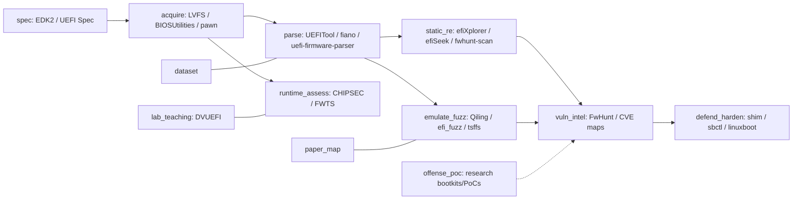

# Domain map — UEFI platform firmware research

```mermaid
flowchart LR
  spec[spec: EDK2 / UEFI Spec] --> acquire[acquire: LVFS / BIOSUtilities / pawn]
  acquire --> parse[parse: UEFITool / fiano / uefi-firmware-parser]
  parse --> static_re[static_re: efiXplorer / efiSeek / fwhunt-scan]
  parse --> emulate_fuzz[emulate_fuzz: Qiling / efi_fuzz / tsffs]
  static_re --> vuln_intel[vuln_intel: FwHunt / CVE maps]
  emulate_fuzz --> vuln_intel
  acquire --> runtime_assess[runtime_assess: CHIPSEC / FWTS]
  vuln_intel --> defend_harden[defend_harden: shim / sbctl / linuxboot]
  offense_poc[offense_poc: research bootkits/PoCs] -.-> vuln_intel
  dataset[dataset] --- parse
  paper_map[paper_map] --- emulate_fuzz
  lab_teaching[lab_teaching: DVUEFI] --- runtime_assess
```

Sibling atlases (planned): `linux-kernel-atlas`, `iot-firmware-atlas`, `rtos-firmware-atlas`, `mcu-firmware-atlas`.
